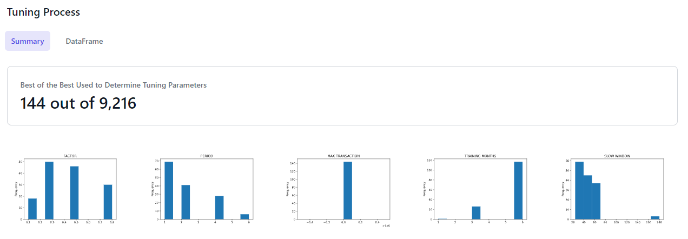

# SABot

**SABot** is a machine learning powered automated trading bot that capitalizes on stablecoin instability.

---

## Overview
Based on earlier analysis (see https://github.com/CAMPSMITH/StableOps),
there may be lucrative arbitrage opportunities with relatively unstable
stable coins, e.g. sUSD. This project will focus on arbitrage trading between
a very stable coin, like USDT, and a more volatile stablecoin, sUSD.
In order to minimize cost and maximize trading opportunities, a low cost
platform and chain with high liquidity of the coins to trade will be used,
candidates being explored are Uniswap V2 on Ethereum chain, Uniswap Optimism,
or KuCoin.

---

## Data Sources

| Dataset | URL         | Description | Records |
|---------|-------------|-------------|---------|
| BTC OHLCV |  | 1.5 years of hourly BTC OHLCV  | 13.1 K |
| ETH OHLCV |  | 1.5 years of hourly BTC OHLCV  | 13.1 K |
| USDT OHLCV |  | 1.5 years of hourly BTC OHLCV  | 13.1 K |
| sUSD OHLCV |  | 1.5 years of hourly BTC OHLCV  | 13.1 K |

---

## Installation

### Prerequisites
Install the following packages:
* Conda
* Jupyter lab
* Finta
* Datapane
* Requests
* Sklearn
* Imblearn
* ccxt
* schedule

---

## Usage

### Getting CryptoCompare Data
Used to get BTC, ETH, USDT data
* run jupyter notebook `historical_hourly_data.ipynb`
### Getting KuCoin Data
Used to get sUSD data
* run jupyter notebook  `Kucoin_ccxt.ipynb`
### Train and Backtest Model
* run jupyter notebook  `model evaluation.ipynb`
### Run sabot
* run 
```
python main.py \
    --model-file "models/model-LogisticRegression-p1-tr6-sw4-lw24-fa0.25-max100000-fee_flat14-fee_pct0.0004-#0.sav" \
    --scaler-file "models/x-scaler-LogisticRegression-p1-tr6-sw4-lw24-fa0.25-max100000-fee_flat14-fee_pct0.0004-#0.sav" \
    --wallet-id 12345 \
    --txn-max 100000 \
    --fast_sma_window 4 \
    --slow_sma_window 42 \
    --factor=0.25 \
    --run_at :33 > logs/sabot.log
```
### Create Presentation
* run jupyter notebook `presentation_datapane.ipynb` 
### View Presentation
* In a browser, view `report.html`

## Model Selection


## Parameter Tuning


## Sabot in action
Sabot decisions (inference)


#### for more details see `report.html`

---

## Contributors

*  **Quintin Bland** <span>&nbsp;&nbsp;</span> |
<span>&nbsp;&nbsp;</span> *email:* quintinbland2@gmail.com <span>&nbsp;&nbsp;</span>|
<span>&nbsp;&nbsp;</span> [](https://www.linkedin.com/in/quintin-bland-a2b94310b/)

*  **Kevin Corstorphine** <span>&nbsp;&nbsp;</span> |
<span>&nbsp;&nbsp;</span> *email:* kevincorstorphine@gmail.com <span>&nbsp;&nbsp;</span>|
<span>&nbsp;&nbsp;</span> [](https://www.linkedin.com/in/kevin-corstorphine-9020a7113/)

*  **John Gruenewald** <span>&nbsp;&nbsp;</span> |
<span>&nbsp;&nbsp;</span> *email:* john.h.gruenewald@gmail.com <span>&nbsp;&nbsp;</span>|
<span>&nbsp;&nbsp;</span> [](https://www.linkedin.com/in/jhgruenewald/)

*  **Martin Smith** <span>&nbsp;&nbsp;</span> |
<span>&nbsp;&nbsp;</span> *email:* msmith92663@gmail.com <span>&nbsp;&nbsp;</span>|
<span>&nbsp;&nbsp;</span> [](https://www.linkedin.com/in/smithmartinp/)

*  **Yanick Wiliksy** <span>&nbsp;&nbsp;</span> |
<span>&nbsp;&nbsp;</span> *email:* yanickw@gmail.com <span>&nbsp;&nbsp;</span>|
<span>&nbsp;&nbsp;</span> [](https://www.linkedin.com/in/yanickwilisky/)

---

## License

[](LICENSE)
